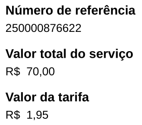
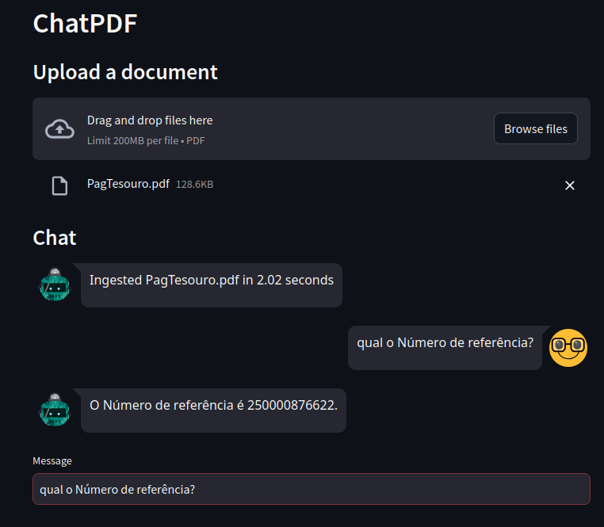

# Run:
```bash
streamlit run app.py
```

# Result

PDF com o número de referência:



Resposta do bot ao usar RAG:



# AI
```bash
CREATE DATABASE "documentos-teste";
# exemplo para Postgres 17 (substitua pela sua versão)
sudo apt update
sudo apt install postgresql-17-pgvector

CREATE EXTENSION IF NOT EXISTS vector;

python3 db-ai/setup.py
python3 db-ai/rag.py
```